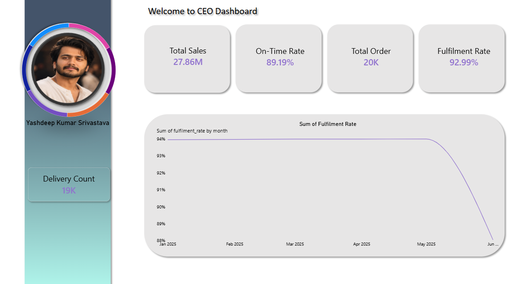
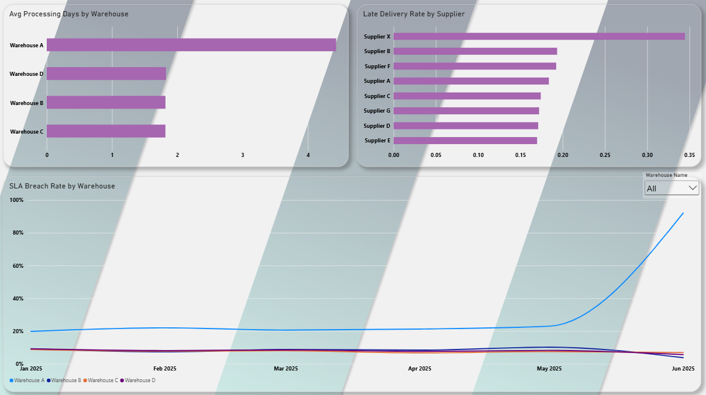
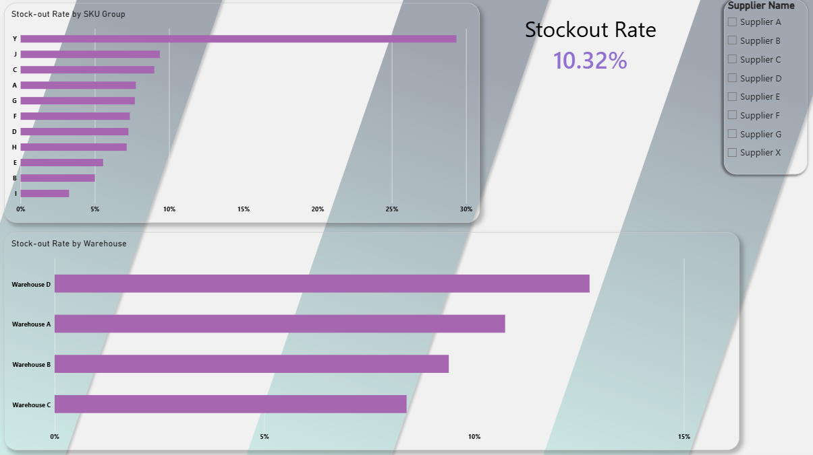
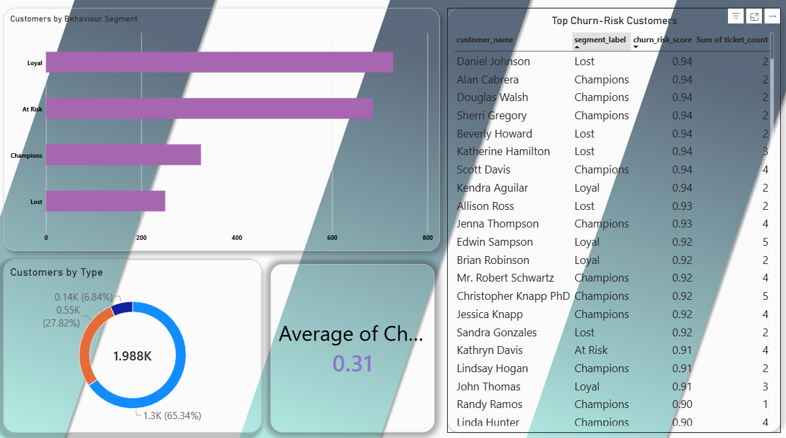
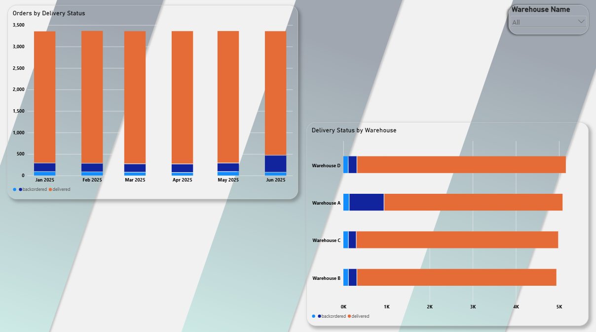
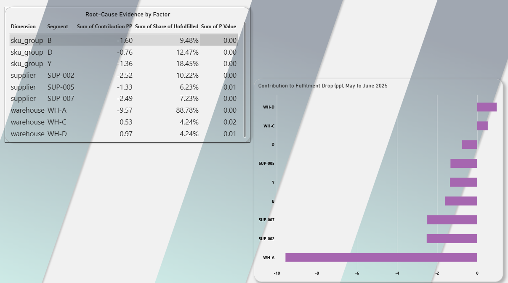

# AI-Powered Business Operations Intelligence & Automation Platform

An end-to-end portfolio case study for a mid-size e-commerce and distribution
business. The project turns synthetic but operationally realistic source data
into validated analytics, explainable business findings, and an auditable
automation workflow.

## Case study: from fragmented operations data to actionable signals

### Problem

Operations teams need to explain fulfilment changes and identify which
warehouse, supplier, inventory group, or customer signals deserve attention.
Spreadsheet-level reporting does not provide a repeatable way to validate
incoming data, trace KPI movement to underlying segments, or record the
resulting actions.

### Business questions

- Is fulfilment falling, and when did the change occur?
- Which warehouse segment contributes most to a decline?
- Which suppliers have the highest late-delivery rate relative to the
  supplier average?
- Which SKU groups have the most inventory stock-outs?
- Are warehouse processing, delivery performance, customer risk, and support
  signals changing together?
- Can a recommendation be generated using only measured evidence and retained
  with an audit trail?

### Architecture

```text
Immutable synthetic CSVs
        |
        v
Validation -> Cleaning / rejected-row quarantine
        |
        v
PostgreSQL (DATABASE_URL) / SQLite fallback
        |
        +--> SQL views and KPI queries
        |
        v
Python features, anomalies, segmentation, statistics
        |
        v
Root-cause decomposition + statistical support
        |
        +--> Power BI-ready CSV exports
        |
        v
Evidence-constrained AI finding and recommendation
        |
        v
n8n pipeline trigger -> threshold alerts -> audit log
        |
        v
Markdown run report
```

The AI layer consumes computed KPI and root-cause evidence. It validates
generated numeric claims against those facts; without an API key, it uses a
deterministic template. The root-cause statistical tests support comparisons
but do not establish causality.

### Measured results

The saved pipeline run compares May and June 2025:

- Fulfilment moved from **93.99%** to **88.06%**, a decline of **5.93
  percentage points**.
- Warehouse A (WH-A) fulfilment moved from **89.50%** to **55.56%**. Its
  volume-weighted contribution was **-9.57 percentage points**, while it
  accounted for **88.8%** of June unfulfilled orders. The contribution is
  larger than the overall decline because other warehouse segments offset
  part of it.
- Supplier X (SUP-001) had a **34.5%** late-delivery rate versus a **20.0%**
  all-supplier average, a **14.46 percentage-point** gap.
- SKU group Y had a **32.6%** stock-out rate (**298** of **915** snapshots),
  representing **46.9%** of the **635** stock-out snapshots in the period.
- The run completed all **8** pipeline steps and emitted **3** threshold
  alerts: low fulfilment, above-average supplier lateness, and high SKU-group
  stock-outs.

These are results from the project’s deterministic synthetic dataset and
saved pipeline output, not claims about a live business. The decomposition is
descriptive: supplier-delay and stock-out evidence are separate operational
signals, not proof of causal impact on fulfilment.

### Sample AI output

```text
Finding: Fulfilment fell from 93.99% in 2025-05 to 88.06% in 2025-06, a change of -5.93 percentage points.
Evidence:
- Warehouse WH-A fulfilment changed from 89.50% to 55.56%; contribution -9.57 pp; 88.8% of unfulfilled orders.
- Supplier SUP-001 had a late rate of 34.5% versus the all-supplier average of 20.0%, a gap of +14.46 percentage points.
- SKU group Y had a stock-out rate of 32.6% (298 of 915 snapshots), representing 46.9% of all 635 stock-out snapshots in the period.
Recommendation:
- Review warehouse WH-A's fulfilment process and investigate late deliveries from supplier SUP-001.
- Review replenishment and inventory controls for SKU group Y.
```

This example is copied from the saved pipeline report. Recommendations are
investigation priorities based on the evidence, not measured business savings.

## Technology

- **Python 3.11** for ingestion, validation, cleaning, analytics, orchestration,
  and tests.
- **Faker, NumPy, and pandas** for deterministic synthetic operational data
  generation and tabular processing.
- **Pandera, SQLAlchemy, PostgreSQL, and SQLite** for data-quality rules,
  database access, and portable local execution.
- **SQLite-compatible SQL** for KPI queries, analytical views, CTEs, and
  window functions.
- **SciPy and scikit-learn** for statistical tests, anomaly detection, feature
  analysis, and customer segmentation.
- **Anthropic SDK** for optional evidence-constrained AI reasoning, with a
  deterministic no-key fallback.
- **Power BI CSV exports** and an importable **n8n** workflow for reporting
  integration and run automation.
- **pytest and Ruff** for automated tests and linting.

## Run the project

Use PowerShell from the repository root. The individual commands below run
one stage at a time in dependency order. Configure `.env` from `.env.example`
for optional credentials and `DATABASE_URL`; SQLite is used when the database
URL is not set.

```powershell
py -3.11 -m venv .venv
.\.venv\Scripts\Activate.ps1
python -m pip install -r requirements.txt
Copy-Item .env.example .env
```

### One command per stage

```powershell
# Generate the deterministic source CSVs
python -m src.generate_data

# Validate raw CSVs and write the validation report
python -m src.validation.validator

# Clean and quarantine rejected rows
python -m src.cleaning.cleaner

# Rebuild the SQL database from clean tables
python -m src.ingestion.load_db

# Execute KPI queries and create reporting views
python -m src.analytics.run_sql

# Run feature, anomaly, customer-segmentation, and statistics analytics
python -m src.analytics.run_analytics

# Decompose the May-to-June fulfilment change
python -m src.analytics.root_cause --kpi fulfilment --from 2025-05 --to 2025-06

# Generate Finding / Evidence / Recommendation output
python -m src.ai_layer.reasoner --question "Why did fulfilment fall this month?"

# Export Power BI-ready CSVs
python -m src.analytics.export_powerbi

# Run the complete validation-to-report automation from a source bundle
python -m src.automation.run_pipeline --file data/raw

# Run automated checks
python -m pytest
```

The end-to-end pipeline command performs validation, cleaning, database
reload, Python analytics, root-cause analysis, AI reasoning, alert evaluation,
and report writing. It writes run-level records to `audit_log`, AI request
records to `ai_audit_log`, a Markdown report to
`data/processed/reports/`, and prints JSON status. It rebuilds operational
tables; use an isolated database for demonstrations.

For n8n setup, execution requirements, alert thresholds, and credentials, see
[docs/automation.md](docs/automation.md). For database configuration, see
[docs/database.md](docs/database.md).

## Power BI dashboard concepts

The project includes six built Power BI dashboard pages and the supporting
Power BI-ready CSV exports. The screenshots below show the completed
Dashboards from Power BI Desktop.

### CEO Overview



Fulfilment falls from 93.99% to 88.06% in June.

### Operations



Warehouse A is the largest contributor at -9.57pp.

### Inventory



SKU group Y's stock-out rate is 32.6%.

### Customer



Customer service and order-quality KPIs are tracked across segments and channels.

### SLA & Delivery



On-time delivery performance is tracked against SLA and service commitments.

### Root Cause



Supplier X's late rate is 34.5% versus a 20.0% average.

### n8n workflow


Dashboard model relationships, DAX measures, visual suggestions, slicers, and
wireframes are in [docs/powerbi_spec.md](docs/powerbi_spec.md). The n8n
workflow export is [n8n/workflow.json](n8n/workflow.json).

## Repository structure

```text
data/
  raw/                  Immutable synthetic CSV source data
  processed/            Validation, clean/rejected data, DB, and run outputs
docs/                   KPI, architecture, analytics, AI, BI, and operations docs
n8n/                    Importable workflow export
powerbi/                Power BI artifacts and generated CSV export location
sql/
  schema/               Operational schema and date dimension
  views/                Reporting views
  kpi_queries/          Numbered KPI and analytical SQL
src/
  analytics/            Features, statistics, root cause, and exports
  ai_layer/             Evidence-grounded reasoning
  automation/            Full run orchestration and audit logging
  cleaning/              Standardization and rejected-row handling
  ingestion/             Database rebuild
  validation/            Source quality checks
  generate_data.py       Reproducible synthetic data generator
tests/                   Focused unit and integration checks
```

## Project materials

- [Business-impact case study](docs/case_study.md)
- [Resume and LinkedIn copy](docs/resume_bullets.md)
- [KPI dictionary](docs/kpi_dictionary.md)
- [Root-cause methodology](docs/root_cause.md)
- [Python analytics notes](docs/python_analytics.md)
- [Power BI specification](docs/powerbi_spec.md)
- [Automation guide](docs/automation.md)
- [MIT License](LICENSE)
